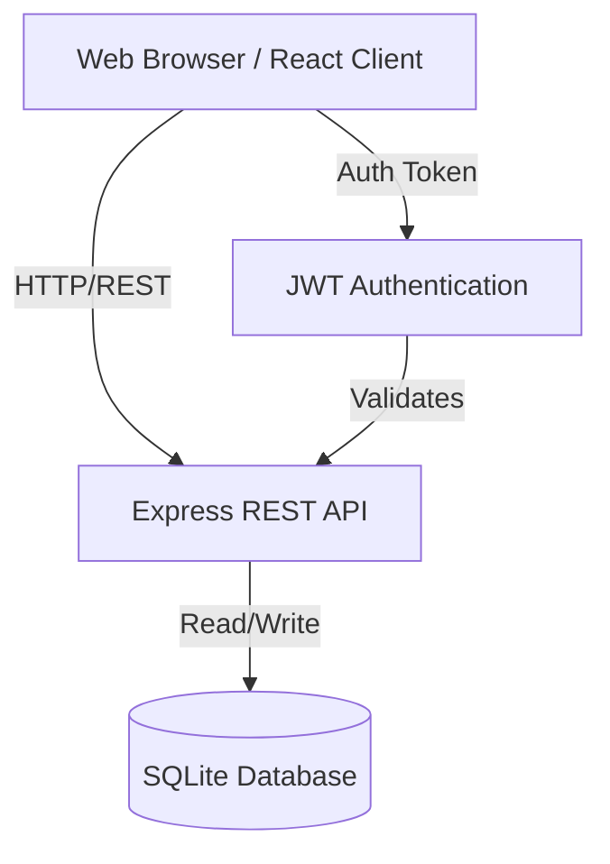
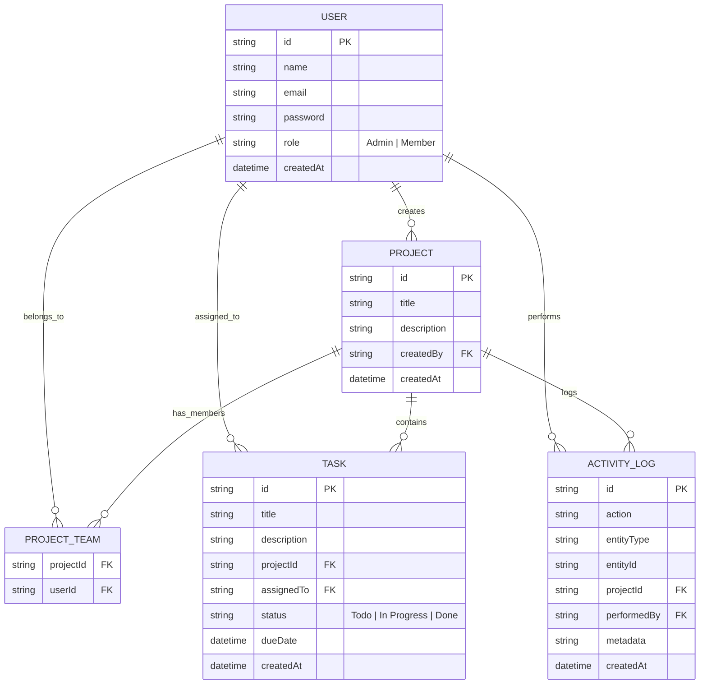
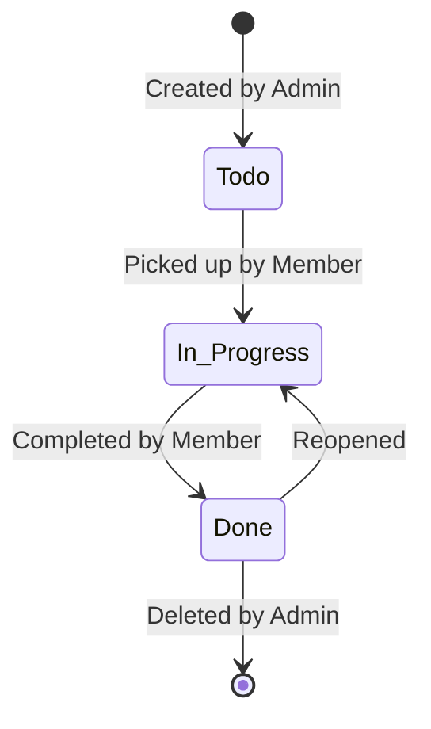

# System Design & Architecture: Team Task Manager

This document provides a comprehensive overview of the system architecture, data models, workflows, and API structure for the **Team Task Manager** application.

---

## 1. System Architecture

The application is built using a modern decoupled architecture consisting of a RESTful backend API and a Single Page Application (SPA) frontend.

* **Frontend:** React.js (Vite), Tailwind CSS, Context API for state management, Axios for data fetching.
* **Backend:** Node.js, Express.js.
* **Database:** SQLite managed via Prisma ORM.
* **Authentication:** JWT (JSON Web Tokens) with Role-Based Access Control (RBAC).

### High-Level Flow Diagram



---

## 2. Entity Relationship Diagram (ERD)

The database follows a relational structure optimized for the Prisma ORM. 



---

## 3. Core Workflows

### Authentication Flow
1. **Signup/Login:** User provides credentials. Backend hashes password (bcrypt) or compares hash.
2. **Token Generation:** Backend issues a JWT signed with `JWT_SECRET`.
3. **Storage:** Frontend stores the JWT in `localStorage`.
4. **Subsequent Requests:** Axios interceptor attaches `Authorization: Bearer <token>` to headers.
5. **Validation:** Backend `protect` middleware verifies the token and attaches the user to the request.

### Role-Based Access Control (RBAC) Flow
* **Admin:** Unrestricted access. Can view all projects, manage members across the system, and delete any resource.
* **Member:** Restricted access. Can only view projects they are a member of. Can only update the `status` of tasks explicitly assigned to them.

### Task Lifecycle Flow


---

## 4. API Endpoints

### Authentication (`/api/auth`)
* `POST /signup` - Register a new user
* `POST /login` - Authenticate user and return JWT

### Users (`/api/users`)
* `GET /` - List all users (Admin only)

### Projects (`/api/projects`)
* `GET /` - List accessible projects
* `GET /:id` - Get project details & tasks
* `POST /` - Create a project
* `PATCH /:id/members` - Update team members (Admin only)
* `DELETE /:id` - Delete project (Admin only)

### Tasks (`/api/tasks`)
* `GET /` - List tasks (with filtering/pagination)
* `POST /` - Create a task
* `PATCH /:id` - Update a task (Members can only update status of their tasks)
* `DELETE /:id` - Delete a task (Admin only)

### Dashboard (`/api/dashboard`)
* `GET /summary` - Get aggregated stats, recent activity, and user's tasks

---

## 5. Security Measures

* **Password Hashing:** `bcryptjs` ensures passwords are never stored in plaintext.
* **Data Sanitization:** Input validation via `express-validator` to prevent bad data injection.
* **Headers Protection:** `helmet` sets secure HTTP headers.
* **CORS Policy:** Strict Cross-Origin Resource Sharing policy to prevent unauthorized domain access.
* **Route Protection:** JWT validation wrapper on all private routes.

---

## 6. Directory Structure Overview

```text
/
├── backend/
│   ├── prisma/             # SQLite DB Schema
│   ├── src/
│   │   ├── config/         # Prisma client, seed logic
│   │   ├── controllers/    # Request handlers (Business Logic)
│   │   ├── middleware/     # Auth & Error middlewares
│   │   ├── routes/         # Express route definitions
│   │   ├── utils/          # Activity logger, helpers
│   │   └── app.js & server.js
│   └── .env                # Backend Environment variables
├── frontend/
│   ├── src/
│   │   ├── components/     # Reusable UI components (Modals, Cards)
│   │   ├── contexts/       # AuthContext, ThemeContext
│   │   ├── hooks/          # Custom React hooks
│   │   ├── pages/          # Full page views (Dashboard, Board, Auth)
│   │   └── services/       # Axios API integration layer
│   └── vite.config.js      # Build & proxy configuration
```
